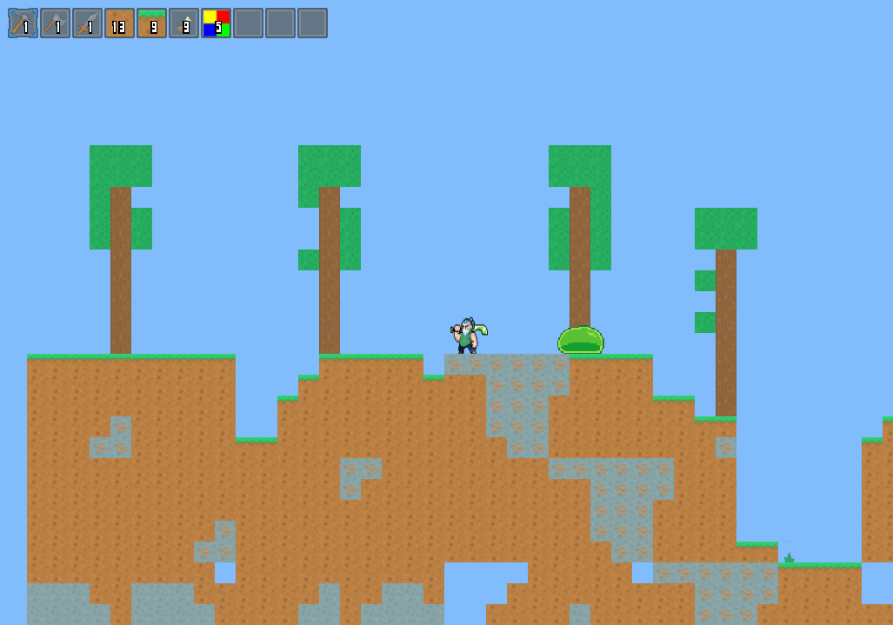

# 2D Game

This is a personal project where I built a 2D game from scratch in C, using modern OpenGL for rendering. The goal was to deepen my understanding of graphics programming and low-level game architecture. 

This was a large undertaking with many moving parts. While many core systems are functional, the game is not fully polished and may crash after extended runtime.

## Screenshot



## Features I implemented

- Main game loop with delta time
- 2D sprite rendering using OpenGL
- Fully custom physics system, including gravity, velocity integration, and collision resolution
- Axis-Aligned Bounding Box (AABB) collision detection
- Dynamic ECS (Entity-Component-System) from scratch
- Procedural world generation using Perlin noise
- Tick system for simulating growth (grass and tree seeds)
- Sprite-based animation system
- Simple enemy entity (slime) with a hitbox and health
- UI for displaying a hotbar


## What I learned

- Built a working ECS in C to explore data-oriented architecture
- Gained experience with OpenGL rendering pipeline using shaders, buffers, and textures
- Designed and implemented a physics engine from scratch, handling 2D movement, collisions, and world interactions
- Developed core game components such as asset loading and animation handling


## What I would do differently

- Redesign the ECS to avoid `void*`, and use a more static and, type safe approach
- Integrate more systems into the ECS architecture to fully leverage its design
- Add debugging tools to make finding errors easier
- Implement a file format or data-driven system to define animation sequences externally, allowing animations to be loaded from files instead of being hardcoded in C


## How to run

Dependencies:
- A C compiler (e.g., gcc, clang)
- OpenGL 3.3+
- GLFW
- GLEW

Build:
```sh
make
./game
```

## Project Structure

```plaintext
/assets       - Textures, tiles, sprites
/src          - C source files
/src/core     - Core, reusable utilities and helpers
/src/game     - Game-specific logic and systems
/src/platform - Platform-specific code
```

## License

Licensed under the MIT License
